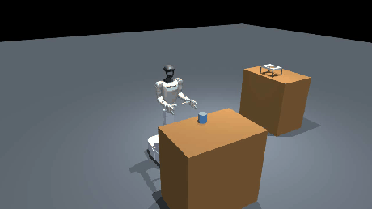
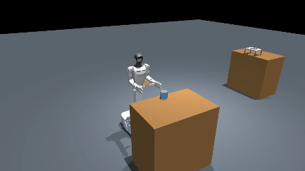
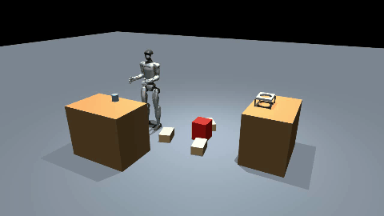
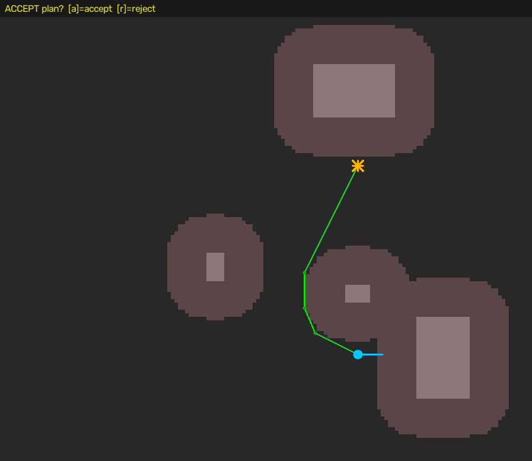

# G1-D Bimanual Manipulation and Locomotion

**An end-to-end autonomy stack for a Unitree G1-D humanoid: SLAM-navigate to a table, pick an object with a
Vision-Language-Action policy, carry it across the room, and place it — under a human accept gate and a LiDAR
failsafe.**

Two halves that compose:

- **Manipulation** — a bimanual pick policy learned from teleoperation demos with a flow-matching VLA
  (NVIDIA GR00T N1.5 / N1.7), plus a multimodal-aware offline evaluation suite and a spatial success-heatmap
  protocol.
- **Locomotion & autonomy** — occupancy-grid SLAM, A\* planning, a supervised-autonomy state machine with a
  non-holonomic base executor, and a MuJoCo digital twin the whole loop is validated in before it ever touches
  hardware.

This is a **methods reference**. No trained weights, no datasets. The manipulated object is a plain cylinder
and the only robot asset is the public Unitree G1 model, fetched on demand.

---

## The full deployment sequence, in the twin

The staged sequence `deploy/deploy_pick.py` runs on the robot, replayed in simulation. Base, trunk and
arms are three independent channels on hardware (`cmd_vel`, `cmd_hispeed`, the arm controller) and are
driven in the same order here:

**base forward → turn to face the object → arms to the inference start pose → trunk up 3 in → creep
forward 5 cm → pick → plan → move → place**



*[full-resolution mp4](docs/videos/twin_deploy.mp4)*

Stage 6 on the robot is the GR00T policy loop, driven through `PolicyClient` inside the governance box.
**In this clip it is the deterministic IK grasp instead** — the subject here is the end-to-end
sequencing and the handoff into navigation, not the policy. The trunk lift is a real DOF on this robot
(a two-stage prismatic Z-lift), so "trunk up 3 in" actually moves.

## The navigation FSM end to end

The same `run_fsm` loop that ships to the robot, driven against MuJoCo. Pick → plan → accept → move → place:



*[full-resolution mp4](docs/videos/twin_nominal.mp4) · the blue cylinder is the target object, the tan boxes
are corridor obstacles the planner routes around, and the far table holds the drop container.*

> **About the robot in these clips.** They are rendered with the **wheeled G1-D**: AGV base, two-stage
> prismatic Z-lift, and two 7-DoF Dex3 hands. That model is not public and is **not included in this
> repository** — see [Honest status](#honest-status). Everything in `sim/` and `nav/` is written against
> whatever `G1_XML` points at, so a clean clone renders the same three scenarios with the public
> `g1_29dof_with_hand_rev_1_0` (legged G1 + the same Dex3 hands) instead. The arms, hands and grasp are
> identical; the base differs.

### The failsafe, doing its job

Identical run, with one unplanned object dropped in the corridor. The planner never saw it, so the LiDAR
`SafetyMonitor` has to catch it at runtime — it E-STOPs the base and **refuses to place**:



*[full-resolution mp4](docs/videos/twin_failsafe.mp4)*

```
[FSM] MOVE (real-time, non-holonomic, LiDAR-guarded)
[SAFETY] E-STOP: LiDAR: object in danger zone
[FSM] halted by safety E-STOP -- not placing
```

### What the operator approves

Before the base moves at all, the planned path is rendered top-down and the run blocks on a human keypress.
Obstacles in grey, their robot-radius inflation as the lighter halo, robot pose and heading in cyan, goal in
orange, A\* path in green:



---

## Architecture

### One FSM, two backends

The core design decision. `nav/nav_fsm.py` is written against a narrow `RobotIO` interface, and the *identical*
state machine runs on either implementation:

| | `SimIO` (`nav/nav_fsm.py`) | `RealIO` (`nav/real_io.py`) |
|---|---|---|
| pose | kinematic integration | odometry from `SportModeState` |
| drive | integrate `(v, ω)` | `LocoClient.Move(vx, 0, vyaw)` |
| occupancy | scene geometry | live LiDAR `PointCloud2` → 2D grid |
| unexpected obstacles | injected intruder | live scan differenced against the planned map |
| pick / place | scripted arm interpolation | taught deterministic skill (`deploy/run_skill.py`) |

So every logic change is testable offline, at speed, with a video artifact — and the thing that runs on a
250 kg-class humanoid has already run a few hundred times in the twin.

### Supervised autonomy, not open-loop autonomy

```
PICK ──▶ PLAN ──▶ [HUMAN ACCEPT] ──▶ MOVE ──▶ PLACE
         A* on                       non-holonomic,
         inflated grid               LiDAR-guarded
```

- **The base is non-holonomic** (forward/back + turn; `vy` is pinned to zero), so each path leg decomposes into
  *turn in place to face the waypoint, then drive straight*, with heading correction while driving.
- **Motion is deliberately slow** — 0.15 m/s straight, 0.4 rad/s turn.
- **Three independent stop paths.** A `SafetyMonitor` thread polls at 20 Hz and E-STOPs on any *unexpected*
  point inside a ±60° / 0.45 m front sector; Ctrl-C at any phase calls `StopMove` and aborts; and a physical
  e-stop stays in a human's hand.
- **The failsafe watches the map-vs-scan difference, not the raw scan.** The planner already keeps clearance
  from known obstacles, so tripping on those would make the robot stop constantly. Only points that were *not*
  in the planned map are treated as intrusions.

### Making the twin physically honest

An animation that reads as fake usually has a specific, findable cause. Four here, each fixed by
measuring the robot rather than picking a number:

| symptom | cause | fix |
|---|---|---|
| base drove **through the corridor boxes** | obstacle inflation used a hand-picked 0.18 m; the wheeled base circumscribes at **0.43 m** | radius derived from the chassis footprint (`base_footprint`), so A\* inflates by what the base actually sweeps |
| base drove **through the table** | the pick standoff was measured to the object, ignoring the table face | stance clamped so the chassis stops one half-depth off the table |
| object **passed through the hands** | the two Dex3 hands are **mirrored** — one closure vector closes the right hand and is silently clamped to zero on the left | closure derived per hand from each joint's own limits (`closed_pose`) |
| object was **set down through the container** | the place moved the object to the drop pose and released | carried over the rim, released, then it falls in |

Two more that only showed up once the numbers were right. The base has **two** relevant sizes — the
circumscribed radius it sweeps when turning in place, and the shallower half-depth it presents when
driving straight at a table — and using the turning circle for docking parks it ~10 cm too far out,
which puts the object beyond arm reach. And the grasp offset was hardcoded to world +y, which is the
robot's lateral axis only while it happens to face +x; at the place table, facing +y, the same call put
one palm in front of the object and the other behind it and the solve blew up to a **2.6 m** residual.
Both grasps now solve to 1–2 mm, and the residual is printed on every run so it cannot hide again.

The corridor itself had to get longer. Inflating any centre obstacle by the real 0.43 m radius covers
about 1.2 m of corridor, which swallowed the original 2.0 m layout whole — no route existed at all, and
the old configuration only *looked* navigable because it planned with a radius the base does not have.

### The two-handed grasp

The object is carried **between both palms**, not hanging off one hand, because that is how the taught skill and
the policy both do it — a 45 mm-radius cylinder is a two-handed object for this robot.

`sim/grasp_ik.py` solves it: damped-least-squares IK on each arm's 7 joints, targeting palm points on opposite
sides of the object, with a nullspace pull toward a natural carry posture. The object then rides the **midpoint
of the two palms** for the rest of the run. Palm residual on the shipped scene is under 1 mm.

Two details that took measuring rather than guessing:

- **The Jacobian has to be taken at the palm point, not the wrist body origin.** `mj_jacBody` linearises the
  body frame, and with a 60 mm palm offset that stalls the solve about 40 mm short of the target — close enough
  to look like a tuning problem and not be one.
- **The arm can only reach ~0.35 m forward at table height.** Sampling 40k random arm configurations puts the
  maximum palm distance at 0.469 m from the shoulder, and 0.346 m forward inside the grasp band. So the base
  drives to a standoff first instead of over-reaching — which is also what the real approach sequence does.

Joint indices are resolved **by name** throughout. The G1-D model orders joints arm, hand, arm, hand, so a
qpos slice that is correct for the hand-less model writes finger angles into the wrong place — silently.

### Cartesian governance on the policy

A learned policy will occasionally command something physically unreasonable. `deploy/policy_client.py` wraps
inference in an axis-aligned end-effector box derived from the demonstration start pose plus explicit margins,
with a z-floor. Violations can be flagged or hard-clamped. The policy cannot drive a hand outside it.

---

## The manipulation half

```
teleop demos ──▶ data/convert_to_lerobot.py ──▶ LeRobot v2.0 dataset
                                                     │
                     train/run_sweep.py (GR00T flow-matching finetune)
                                                     │
        eval/  ── offline multimodal battery  +  spatial success heatmap
                                                     │
              deploy/  policy_runner.py · deploy_pick.py
```

**Data.** `data/convert_to_lerobot.py` turns per-frame teleop recordings (RGB + joint states/actions) into a
GR00T-ready **LeRobot v2.0** dataset: 3 cameras (head + two wrists), 28-dim state/action (2×7 arm + 2×7 hand),
and either **absolute** or **delta** (residual-to-current) action encoding. `data/make_split.py` builds a
reproducible train / held-out split stratified by a **difficulty score** — `z(episode_length) + z(arm_travel)`
— so the held-out set spans easy→hard uniformly instead of being an arbitrary tail.

**Training.** GR00T's action head is a **flow-matching** transformer, so the objective is already generative
rather than an MSE regression. `train/run_sweep.py` runs a small controlled comparison of the design choices
that actually matter here — absolute vs. delta actions, mixed vs. curriculum data ordering — each scored on the
same held-out split. `train/README.md` documents the **8-bit paged-AdamW recipe** that makes a full action-head
finetune fit a single 24 GB GPU; the naive fp32 optimizer does not fit.

**Evaluation.** Action-MSE is the wrong metric for a **multimodal** task. There are many valid ways to gather
and lift an object, and MSE rewards averaging across them — a policy that splits the difference between two
good strategies scores well and behaves badly. The battery instead samples the flow head N times per
observation and reports best-of-N error, sample diversity, timing-robust DTW, an open-loop horizon-error curve,
and task-specific "did the arms actually spread-and-commit / did the hand close" signals. Full list with
citations in `eval/EVAL_METRICS.md`. `eval/spatial_heatmap.py` builds a **success-rate heatmap** over object
positions, with confidence intervals, a training-distribution overlay, and a failure-mode breakdown — the
protocol for honestly reporting real-robot generalization.

**Deployment.** `deploy/policy_runner.py` is a light control loop with a live camera preview (confirm the
streams before engaging), compliant PD with a joint-velocity cap, the Cartesian governance box, and support for
absolute and delta policies. It records a review video of every run.

---

## Layout

```
nav/                        navigation and supervised autonomy
  nav_fsm.py                the FSM + SimIO digital-twin backend
  real_io.py                the hardware backend (Unitree SDK: LocoClient, DDS odometry, LiDAR)
  nav_planner.py            occupancy grid, inflation, A*, top-down view, accept gate  (offline self-test)
  twin.py, twin_rerun.py    live Rerun digital twin
  slam_view.py              live SLAM map viewer
  save_map.py, load_map.py  map persistence
  waypoints.py, dock_waypoints.py, ai_waypoints.py    teach-and-repeat waypoints
  table_align.py, table_probe.py, front_dist.py       final table approach from LiDAR
  failsafe_test.py, base_test.py, sport_check.py      commissioning checks
  nav2/                     ROS 2 Nav2 launch, params and map relay

sim/                        the digital twin
  scene.py                  procedural MuJoCo scene (G1+Dex3 + tables + cylinder + obstacles) + occupancy
  grasp_ik.py               name-resolved joint tables + bimanual grasp IK
  animate.py                scripted pick→carry→place animation
  render_demo.py            regenerate the videos and figures in this README (3 scenarios)
  cylinder_scene.py         minimal Isaac scene (G1 + table + cylinder)

deploy/                     on-robot execution
  deploy_pick.py            approach + VLA-policy pick orchestrator (base, trunk, arms as independent channels)
  policy_client.py          HTTP client to the inference server + the Cartesian governance box
  policy_runner.py          control loop with live camera preview, compliant PD, delta decode
  freedrive.py              kinesthetic free-drive: push the arm by hand to teach a pose
  teach_skill.py            record a taught skill;  run_skill.py replays it
  ee_ik.py                  end-effector FK/IK
  dex3_direct.py            direct dexterous-hand driver
  base_move.py, trunk_up.py, place_drop.py, arm_squeeze.py, grip_hold.py, align_table.py
  live_source.py            live camera source;  laserscan_idl.py  LiDAR DDS types

data/                       teleop recordings → LeRobot v2.0 dataset, difficulty-stratified splits
train/                      GR00T finetune sweep, 8-bit recipe, RL-token scaffold
eval/                       multimodal offline battery, spatial success heatmap, pick reward
```

---

## Kinesthetic teaching

`deploy/freedrive.py` lets you grab the arm and move it, then have it hold where you left it — the fastest way
to author a deterministic skill without a VR rig.

Getting this to feel right took more iterations than expected, and the failures are instructive. Gravity
compensation from the URDF model was wrong enough to matter, so the controller learns it from **measured**
`tau_est` instead. Naively switching to low stiffness while moving created a trap where the arm sagged under
the weight of the hands and then got stuck at low gain; and treating that sag as an operator push made the
controller drift on its own. The shipped design is a latch: firm PD hold by default, an explicit SPACE toggle
between light-move and locked-hold, and a one-time gravity calibration that never lets the hold go light.

---

## Setup

```bash
pip install -r requirements.txt
python scripts/fetch_g1_assets.py     # public Unitree G1 + Dex3 MJCF + meshes (~36 MB, once)
```

**Run the whole pipeline in the twin — no GPU, no robot, no checkpoint:**

```bash
python nav/nav_fsm.py --auto --out /tmp/run.mp4          # end-to-end, writes a video
python nav/nav_fsm.py --auto --intruder --out /tmp/f.mp4 # demo the LiDAR failsafe
python nav/nav_planner.py --demo --out /tmp/plan.png     # planner self-test alone
python sim/render_demo.py                                # all three scenarios + the plan figure
python sim/render_demo.py --scenarios deploy             # just the staged deployment sequence

# render against a different robot (any MJCF with the same arm/hand joint names)
G1_XML=/path/to/your_robot.xml python sim/render_demo.py
```

On macOS prefix with `MUJOCO_GL=cgl`; on a headless Linux box use `MUJOCO_GL=egl`.

**On the robot** (commission carefully, physical e-stop in hand):

```bash
python nav/nav_fsm.py --real --iface <iface> \
    --pick-skill deploy/skills/pick.json --place-skill deploy/skills/place.json \
    --place-x 0.0 --place-y 2.0
```

### Dependencies

Core twin: `mujoco`, `numpy`, `opencv-python`, `imageio`. Everything above runs on these alone.

Hardware and training add: `unitree_sdk2py` (DDS + `LocoClient`), ROS 2 + Nav2 +
[Slamtec `slamware_ros_sdk`](https://github.com/Slamtec/slamware_ros_sdk) for SLAM, `pinocchio` for IK,
`rerun-sdk` for the live twin, `json-numpy` and `requests` for the inference client, and
[Isaac-GR00T](https://github.com/NVIDIA/Isaac-GR00T) for the VLA itself.

---

## Honest status

- **Validated in the twin:** the FSM, the A\* planner and inflation, the non-holonomic executor, the accept
  gate, the map-vs-scan failsafe, and the Ctrl-C killswitch. Both videos above are real runs of the shipped
  code — reproduce them with one command.
- **Approximated in the twin:** the base is integrated kinematically rather than simulated with wheel dynamics,
  and the grasp is solved with IK and then held — the fingers close on the object but no contact forces are
  computed, so nothing here says the grasp would be *stable*. The twin proves the *logic and the geometry*,
  not the contact physics.
- **On the robot model, and why the committed clips are not byte-reproducible.** The videos here were
  rendered with the internal **wheeled G1-D** (AGV base, two-stage Z-lift, Dex3 hands). That asset is not
  public and is deliberately **not committed**, so running `sim/render_demo.py` from a clean clone will
  render the same three scenarios with the public `g1_29dof_with_hand_rev_1_0` — legged base, identical
  arms and identical Dex3 hands — and the output will differ from the GIFs above below the waist. Nothing
  in the code is specific to either: `sim/scene.py` reads `G1_XML`, resolves every joint by name, adds a
  floating base if the asset has a fixed one, derives the stand height from the geometry, and drives the
  wheels and Z-lift only if that robot has them. The public model is fetched from
  [MuJoCo Menagerie](https://github.com/google-deepmind/mujoco_menagerie) rather than vendored, so this
  repository carries no robot assets of its own.
- **The work surface is 0.90 m** because the reach envelope of both robots was measured rather than
  assumed. The G1-D cannot bring its palms much below ~0.92 m with its lift extended, so a standard
  0.74 m bench is physically unreachable for it; 0.90 m is comfortable for both.
- **Hardware-gated:** `real_io.py` carries `TODO(robot)` markers on the odometry topic name, the LiDAR
  `PointCloud2` field layout, and the LiDAR→base mount transform. Those are commissioning items, not solved
  problems.
- **Two different picks.** Inside the navigation FSM, pick and place are *taught deterministic skills* —
  reliable, and they isolate navigation faults from policy faults. The **VLA policy pick** is the separate
  `deploy/deploy_pick.py` orchestrator. Fusing them into one autonomous run is the current edge of the work.
- Offline metrics rank checkpoints and catch mode collapse; they cannot capture closed-loop compounding error.
  The real gate is on-robot success (`eval/spatial_heatmap.py`).

## What is not here

No trained weights, no datasets, no robot assets. The GR00T checkpoints, the teleoperation recordings
and the wheeled-base description used to render the clips all stay where they are; this repository is
the pipeline, the control logic and the evaluation method. The one robot model it will fetch is the
public Unitree G1 + Dex3 from MuJoCo Menagerie.

## Provenance

Extracted from a private research monorepo. The manipulated object is a neutral cylinder throughout — the
stand-in the simulation configs already used — and no internal assets, datasets, hostnames, or checkpoints are
included.

## License

MIT — see `LICENSE`.
